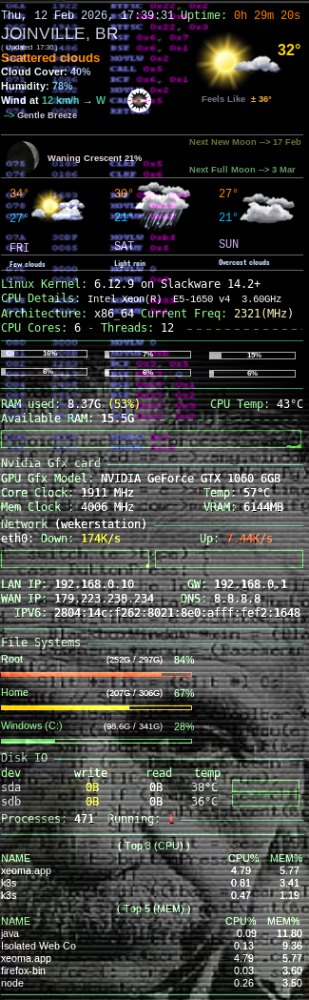
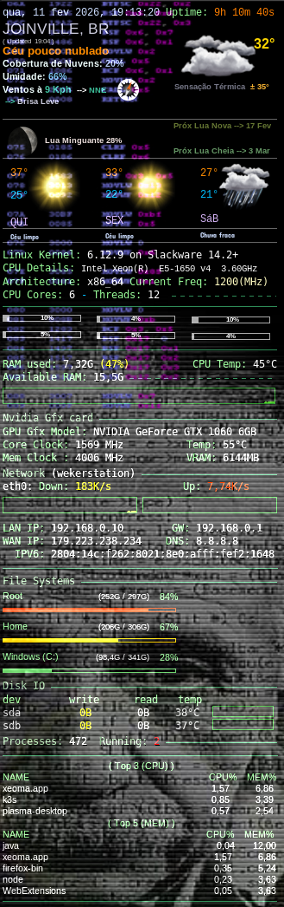
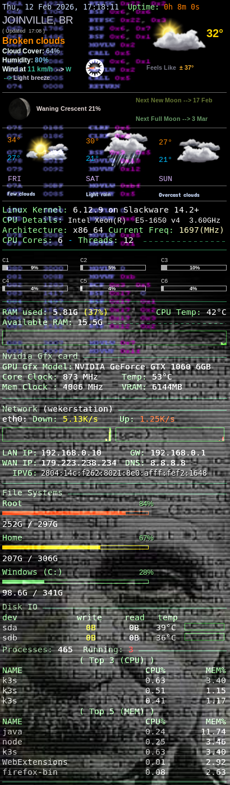
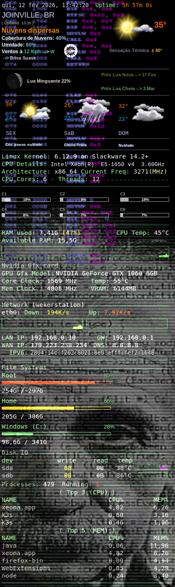
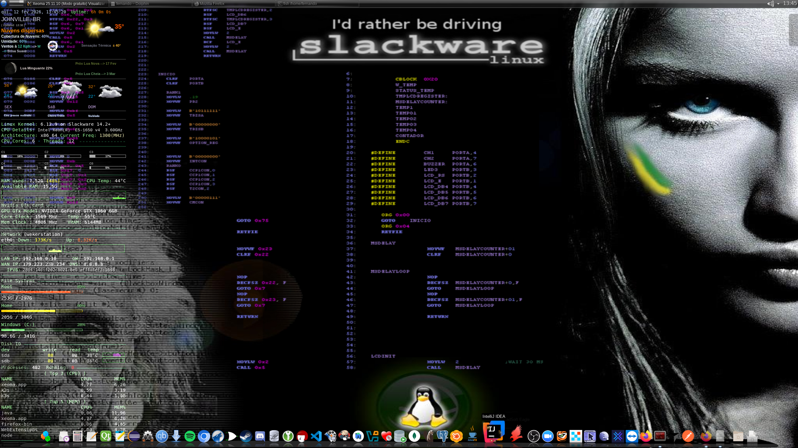

# Conky – Monitor de Desktop Moderno (Sem Lua, Conky ≥ 1.22)


---

> **Status:** Estável  
> **Versão Atual:** v2.0  
> **Versão Legada:** v1.10 (baseada em Lua, arquivada)

---

## Idioma

- 🇺🇸 [English version](README.md)
- 🇧🇷 Você está lendo a versão em Português.

---

> **Versão 2.0** – Migração completa do (Conky 1.10 legado + Lua) para uma **configuração pura Conky 1.22+**, sem necessidade de usar a línguagem Lua.

Este projeto fornece uma **configuração moderna, elegante e altamente personalizável do Conky**, com:

- 🌦️ Clima (OpenWeatherMap)
- 🌙 Fases da lua (geração local, sem dependência da NASA)
- 📊 Monitoramento de CPU / RAM / Disco / Rede
- 🧩 Estatísticas da GPU NVIDIA (opcional)
- 🖥️ Layouts multi-resolução (1080p / 2K)
- 🌍 Suporte a múltiplos idiomas (EN / PT-BR detectado automaticamente)
- ❌ Configuração completamente **sem Lua**
- 🚀 Compatível com **AppImage** (sem instalação)

## 📦 Estrutura do Repositório

```css
conky/
├── conkyrc/
│   ├── .conkyrc_1080p
│   └── .conkyrc_2k
├── images/
│   ├── ícones do clima
│   └── ícones de vento
├── fonts/
├── printscreen/
├── time.sh
├── GetMoon.sh
├── lune_die.sh
├── moon.pl
├── moon_age.pl
├── moon_texture.jpg
├── conky.sh
└── README.md
```

---

## 🚀 Versões Suportadas

| Versão             | Status       | Descrição                      |
| ------------------ | ------------ | ------------------------------ |
| **v2.0 (main)**    | ✅ Ativo     | Conky **1.22+**, Sem Lua       |
| **v1.10 (legada)** | 🧊 Congelado | Conky **1.10**, baseado em Lua |

O suporte legado é preservado em:

- **Branch:** `legacy-1.10`
- **Tag:** `v1.10-legacy`

---

## Versionamento

Este projeto segue o Versionamento Semântico e documenta todas as mudanças notáveis
em [CHANGELOG.md](CHANGELOG.md).

---

## 🖥️ Capturas de Tela

### 1080p

| EN                                            | PT-BR                                            |
| --------------------------------------------- | ------------------------------------------------ |
|  |  |

### 2K / 2560×1440

| EN                                         | PT-BR                                         |
| ------------------------------------------ | --------------------------------------------- |
|  |  |

### Fullscreen



---

## 🔧 Requisitos

### Obrigatórios

- **Conky ≥ 1.22**
- `curl`
- `xmllint`
- `perl`
- `lm-sensors`

### Opcionais (GPU)

- `nvidia-smi` (para GPUs NVIDIA)

---

## 🌦️ API OpenWeatherMap

Os dados climáticos usam a **API XML do OpenWeatherMap.**

> As primeiras **1.000 chamadas de API por dia são GRATUITAS**

### 1️⃣ Crie sua chave de API

👉 [https://openweathermap.org/api](https://openweathermap.org/api)

### 2️⃣ Crie o arquivo de segredos

```bash
mkdir -p ~/.config/conky
nano ~/.config/conky/secrets.conf
chmod 600 ~/.config/conky/secrets.conf
```

```ini
OWM_APPID=YOUR_API_KEY_HERE
```

A chave **nunca é codificada** no `.conkyrc`.

---

## 🌙 Lua & Astronomia - Moon Phase System (Offline)

As fases da lua são geradas **localmente**, sem requisições HTTP.

- Substitui a antiga solução baseada na NASA
- Funciona tanto na **v1.10 quanto na v2.0**
- Suporta tradução para PT-BR automaticamente

Scripts envolvidos:

- `GetMoon.sh`
- `lune_die.sh`
- `moon.pl`
- `moon_age.pl`

Scripts Internos

- `time.sh`  
  Lógica central para clima, vento, lua e localização.
  Toda a análise de dados e troca de idioma acontece aqui.

---

## 🛠️ Opções de Instalação

---

### Opção A – AppImage (Recomendada e Fácil)

Sem necessidade de instalação.

```bash
git clone https://github.com/wekers/conky.git
cd conky
# baixe o AppImage de https://github.com/brndnmtthws/conky/releases
chmod +x conky-ubuntu-24.04-x86_64-v1.22.2.AppImage

./conky-ubuntu-24.04-x86_64-v1.22.2.AppImage -c conkyrc/.conkyrc_2k
```

Ou para Full HD:

```bash
./conky-ubuntu-24.04-x86_64-v1.22.2.AppImage -c conkyrc/.conkyrc_1080p
```

---

### Opção B – Compilar a partir do Código Fonte (Avançado)

#### Pré-instalação

```bash
pip3 install pyyaml Jinja
```

#### Compilação

```bash
tar -zxvf conky-1.22.2.tar.gz
cd conky-1.22.2
mkdir build && cd build

cmake \
  -DCMAKE_INSTALL_PREFIX=/usr \
  -DBUILD_DOCS=OFF \
  -DBUILD_EXTRAS=ON \
  -DBUILD_XDBE=ON \
  -DBUILD_CURL=ON \
  -DBUILD_WLAN=ON \
  -DBUILD_RSS=ON \
  -DBUILD_PULSEAUDIO=ON \
  -DBUILD_MPD=ON \
  -DBUILD_IMLIB2=ON \
  -DBUILD_LUA_CAIRO=ON \
  -DBUILD_LUA_IMLIB2=ON \
  -DBUILD_WAYLAND=ON \
  -DBUILD_MOUSE_EVENTS=ON \
  -DCMAKE_BUILD_TYPE=Release ..

make
sudo make install
```

---

## ▶️ Executando o Conky

```bash
./conky.sh
```

ou manualmente:

```bash
conky -c conkyrc/.conkyrc_2k
```

---

## 🌍 Suporte a Idiomas

O idioma é detectado automaticamente via LANG.

| LANG    | Saída     |
| ------- | --------- |
| `pt_BR` | Português |
| outros  | Inglês    |

Aplica-se a:

- Rótulos do clima
- Fases da lua
- Descrições do vento:

## 🧠 Filosofia de Design (v2.0)

Este projeto foi completamente reestruturado na versão 2.0 devido a:

- Mudanças nas APIs upstream (dados da NASA / Lua)
- Instabilidade do Lua no Conky e custo de manutenção
- Desejo de uma configuração portátil e compatível com AppImage

A versão 2.0 remove todas as dependências de Lua e depende apenas de:
Bash, Perl (local) e recursos nativos do Conky.

- ❌ Sem Lua
- ✅ Objetos nativos do Conky
- ✅ Configurações portáteisConfigurações portáteis
- ✅ Manutenção mais fácil
- ✅ Compatível com Wayland e X11
- ✅ Gerenciamento seguro de segredos

---

## 🧊 Versão Legada (Conky 1.10)

Se você ainda usa Conky 1.10:

```bash
git checkout legacy-1.10
```

Tag:

```bash
git checkout v1.10-legacy
```

---

## 📜 Licença

Licença MIT  
© Fernando Gilli
