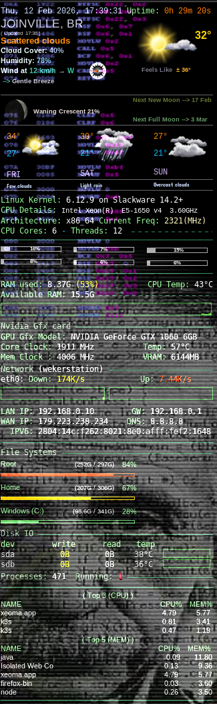
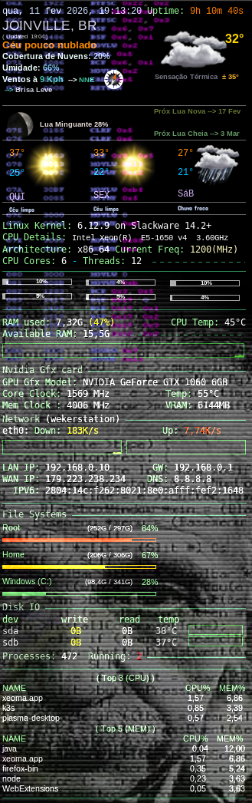
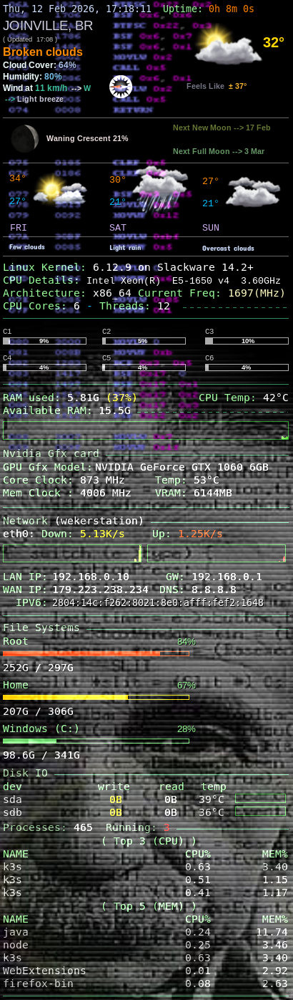
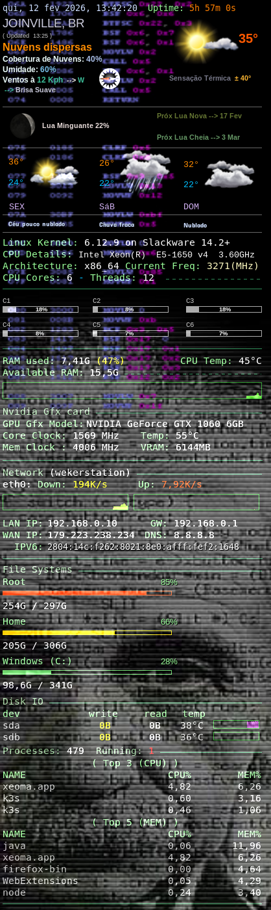
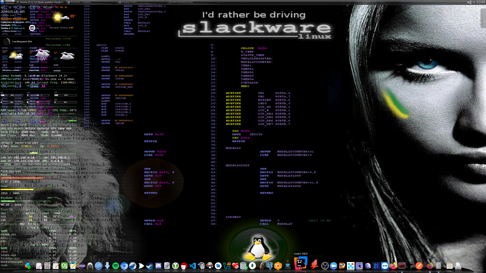

# Conky – Monitor de Desktop Moderno (sem scripts Lua, Conky ≥ 1.22)


---

### Uma configuração Conky totalmente portátil, sem dependência da linguagem Lua, com instalação automatizada e compatível com múltiplas distribuições.

---

> **Status:** Estável  
> **Versão:** v2.1.0  
> **Filosofia:** Dependências mínimas, portabilidade máxima

---

## Idioma

- 🇺🇸 [Versão em inglês](README.md)
- 🇧🇷 Você está lendo a versão em português.

---

## ✨ Visão Geral

Uma configuração **moderna, elegante e sem dependência de scripts Lua**, projetada para:

- ⚡ portabilidade (pronta para AppImage)
- 🧩 scripts modulares
- 🌍 suporte multilíngue
- 🖥️ layouts para múltiplas resoluções

## 🎯 Por que este projeto?

A maioria das configurações de Conky depende de Lua e caminhos fixos (hardcoded).

Este projeto oferece:

- Uma arquitetura sem dependência de Lua
- Scripts totalmente portáveis
- Compatibilidade entre diferentes distribuições
- Instalação e manutenção simplificadas

### Recursos

- 🌦️ Integração com OpenWeatherMap (API XML)
- 🌙 Renderização offline das fases da lua (sem APIs externas)
- 📊 Monitoramento de CPU / RAM / Disco / Rede
- 🧠 localização inteligente (EN / PT-BR detectada automaticamente)
- 🖥️ Layouts para 1080p e 2K
- 🎮 Suporte opcional a GPU NVIDIA
- ❌ Nenhum script Lua é necessário

---

## 📸 Capturas de Tela

### 1080p

| EN                                             | PT-BR                                            |
| ---------------------------------------------- | ------------------------------------------------ |
|  |  |

### 2K / 2560×1440

| EN                                          | PT-BR                                         |
| ------------------------------------------- | --------------------------------------------- |
|  |  |

### Tela Cheia



---


## 📦 Estrutura do Repositório

```css
conky/
├── conkyrc/
│   ├── .conkyrc_1080p
│   └── .conkyrc_2k
├── images/
│   ├── weather icons
│   └── wind icons
├── CHANGELOG.md
├── LICENSE
├── conky-1.22.2.tar.gz
├── fonts/
├── printscreen/
├── init.sh
├── install.sh
├── time.sh
├── GetMoon.sh
├── lune_die.sh
├── moon.pl
├── moon_age.pl
├── moon_texture.jpg
├── conky.sh
├── README.pt-BR.md
└── README.md
```

---

## 🚀 Inicio Rapido (Recomendado)
- ### 🌦️ API do OpenWeatherMap
  - Os dados meteorológicos usam a **API XML do OpenWeatherMap**.

    > As primeiras **1.000 chamadas de API por dia são GRATUITAS**

- ### 1️⃣ Crie sua chave de API

  👉 [https://openweathermap.org/api](https://openweathermap.org/api)

### 2️⃣ Clone o Projeto:
```bash
git clone https://github.com/wekers/conky.git
cd conky

# Instala dependências automaticamente
./install.sh

# Configure sua chave de API
nano ~/.config/conky/secrets.conf

# Inicie o Conky
./conky.sh
```


### 3️⃣ Configure sua chave de API e sua cidade (cidade,país):
```ini
OWM_APPID=YOUR_API_KEY
OWM_CITY=Salvador,BR
```
A chave nunca é definida diretamente no `.conkyrc`.

### 4️⃣ Execute:

```bash
./conky.sh # start (padrão)
./conky.sh start

./conky.sh stop
./conky.sh restart
```

---

## 🐧 Distribuições Suportadas

- Ubuntu / Debian
- Linux Mint
- Fedora
- Arch Linux
- Slackware

O script `install.sh` detecta automaticamente sua distribuição e instala as dependências corretas.

---

## ⚙️ Configuração

### 🌐 Interface de Rede

Comando de autodetecção:

```bash
ip route 2>/dev/null | awk '/default/ {print $5; exit}'
```

Edite em `.conkyrc`:

```lua
template0 = 'eth0'
```

Valores comuns:

| Interface | Descrição         |
|----------|-------------------|
| eth0     | Ethernet legada   |
| enp0s3   | Ethernet moderna  |
| wlp2s0   | Wi-Fi             |

---

### 🌍 Configuração do Clima

Arquivo:

```bash
~/.config/conky/secrets.conf
```

Exemplo:

```ini
OWM_APPID=YOUR_API_KEY
OWM_CITY=Salvador,BR
```

---

### 🌙 Correção do Hemisfério da Lua

Se você estiver no **Hemisfério Norte**, edite:

```bash
GetMoon.sh
```

Altere:

```bash
HEMISPHERE="s"
```

para:

```bash
HEMISPHERE="n"
```

---

## 🧠 Arquitetura

```text
conky.sh
   └── init.sh (bootstrap do clima)
          └── time.sh (lógica central)
                 ├── parsing do clima
                 ├── localização
                 ├── vento + unidades
                 └── integração da lua
                        └── GetMoon.sh
                               └── scripts em perl
```

### Componentes Principais

| Script      | Responsabilidade                 |
|-------------|----------------------------------|
| conky.sh    | ciclo de vida (start/stop/restart) |
| init.sh     | inicialização do clima           |
| time.sh     | motor central de processamento   |
| GetMoon.sh  | renderização da lua              |
| *.pl        | cálculos astronômicos            |

---

## ▶️ Uso

```bash
./conky.sh start
./conky.sh stop
./conky.sh restart
```

---

## 🔧 Requisitos

### Obrigatórios

- Conky ≥ 1.22
- curl
- lm-sensors
- bc
- imagemagick
- libxml2-utils (xmllint)
- perl + Astro::MoonPhase

### Opcionais

- nvidia-smi (estatísticas da GPU)

---

## 🧩 Opções de Instalação

---

### [Opção A — Início Rápido (Recomendado)](#-inicio-rapido-recomendado) ☝️
---

### Opção B – AppImage (Método Fácil Alternativo)
- Baixe o AppImage em https://github.com/brndnmtthws/conky/releases
#### Dependências obrigatórias:
- curl
- lm-sensors
- bc
- imagemagick
- libxml2-utils (xmllint)
- perl + Astro::MoonPhase

```bash
Executar apenas a primeira vez:

./init.sh

Então:

chmod +x conky-*.AppImage
./conky-*.AppImage -c conkyrc/.conkyrc_2k
ou
./conky-*.AppImage -c conkyrc/.conkyrc_1080p
```

---

### Opção C - Compilar a Partir do Código-Fonte (Avançado)

#### Pré-instalação

```bash
pip3 install pyyaml Jinja2
```

#### Compilação

```bash
tar -zxvf conky-1.22.2.tar.gz
cd conky-1.22.2
mkdir build && cd build

cmake \
  -DCMAKE_INSTALL_PREFIX=/usr \
  -DBUILD_DOCS=OFF \
  -DBUILD_EXTRAS=ON \
  -DBUILD_XDBE=ON \
  -DBUILD_CURL=ON \
  -DBUILD_WLAN=ON \
  -DBUILD_RSS=ON \
  -DBUILD_PULSEAUDIO=ON \
  -DBUILD_MPD=ON \
  -DBUILD_IMLIB2=ON \
  -DBUILD_LUA_CAIRO=ON \
  -DBUILD_LUA_IMLIB2=ON \
  -DBUILD_WAYLAND=ON \
  -DBUILD_MOUSE_EVENTS=ON \
  -DCMAKE_BUILD_TYPE=Release ..

make
sudo make install
```

---

## 🪟 Uso no Windows 10/11 (com WSL2)

Funciona com limitações:

### Suportado
- Clima
- Fases da lua
- Informações do Sistema (parcial)
- Renderização

### Limitações
- Sensores (CPU temperatura, etc.)
- Sem suporte ao `hddtemp`
- Métricas do sistema são limitadas

### Recomendação
- WSL é suportado apenas para testes e desenvolvimento.
- Para ter uma funcionalidade completa, use **Linux**.

---

## 🌍 Suporte a Idiomas

Detectado automaticamente via `LANG`.

| LANG    | Saída      |
|--------|------------|
| pt_BR  | Português  |
| others | Inglês     |

Aplica-se a:

- Rótulos do clima
- Fases da lua
- Descrições do vento

---

## 🛠️ Solução de Problemas

### ❌ Clima não aparece

- Verifique a chave de API
- Verifique o formato da cidade: `city,country`
- Valide o cache XML:

```bash
cat ~/.cache/weather_current.xml
```

---

### ❌ Conky não inicia

- Certifique-se de que os scripts são executáveis:

```bash
chmod +x *.sh
```

- NUNCA use:

```bash
sh script.sh
```

Use:

```bash
./script.sh
```

---

### ❌ Rede mostrando 0

- Interface incorreta em `template0`
- Execute o comando de detecção e confira no .conkyrc em `template0`
```bash
ip route 2>/dev/null | awk '/default/ {print $5; exit}'
```

---

### ❌ Renderização da lua invertida

- Corrija o hemisfério em `GetMoon.sh`

---

### ❌ xmllint não encontrado

- Instale:

```bash
sudo apt install libxml2-utils
```

---

### ❌ Astro::MoonPhase não encontrado


- Instale:

```bash
sudo cpanm Astro::MoonPhase
```

---

### ❌ Nenhum sensor encontrado

- Execute:

```bash
sudo sensors-detect
```
---
## 🚀 Versões Compatíveis

| Versão             | Status       | Descrição                       |
| ------------------ | ------------ | ------------------------------- |
| **v2.1.0 (main)**    | ✅ Ativa     | Conky **1.22+**, configuração sem dependência de scripts em Lua |
| **v1.10 (legacy)** | 🧊 Congelada | Conky **1.10**, linguagem baseada em Lua |

O suporte legado é preservado em:

- **Branch:** `legacy-1.10`
- **Tag:** `v1.10-legacy`

---

## Versionamento

Este projeto segue o **Versionamento Semântico** e documenta todas as mudanças relevantes
em [CHANGELOG.md](CHANGELOG.md).

---

## 🧠 Filosofia de Design (v2.0)

Este projeto foi totalmente refatorado na versão 2.0 devido a:

- Mudanças na API upstream (NASA / dados da lua)
- Instabilidade do script Lua no Conky e custo de manutenção
- Necessidade de portabilidade

A versão 2.0 remove todas as dependências da linguagem Lua e depende apenas de:

- Bash
- Perl (local)
- recursos nativos do Conky
- ❌ Nenhum script em Lua é necessário
- ✅ Objetos nativos do Conky
- ✅ Configurações portáteis
- ✅ Fácil manutenção
- ✅ Compatível com Wayland e X11
- ✅ Tratamento seguro de segredos (Secrets)

---

## 🧊 Versão Legada

```bash
git checkout legacy-1.10
```

---
## 📄 Licença / Uso
Licença MIT

Sinta-se à vontade para:
- clonar
- modificar
- adaptar conforme sua necessidade
  
* * *

### 👉 Se este projeto te ajudou, uma ⭐ no repositório já vale um café. ☕🙂

* * *
© WeKeRs